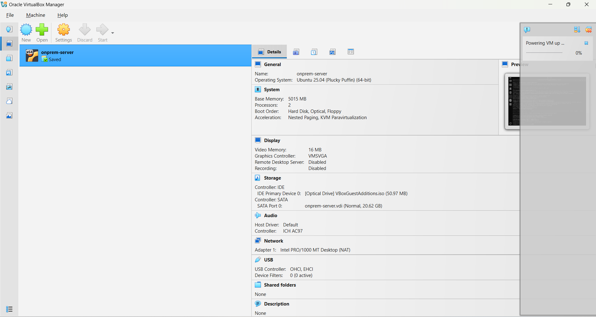
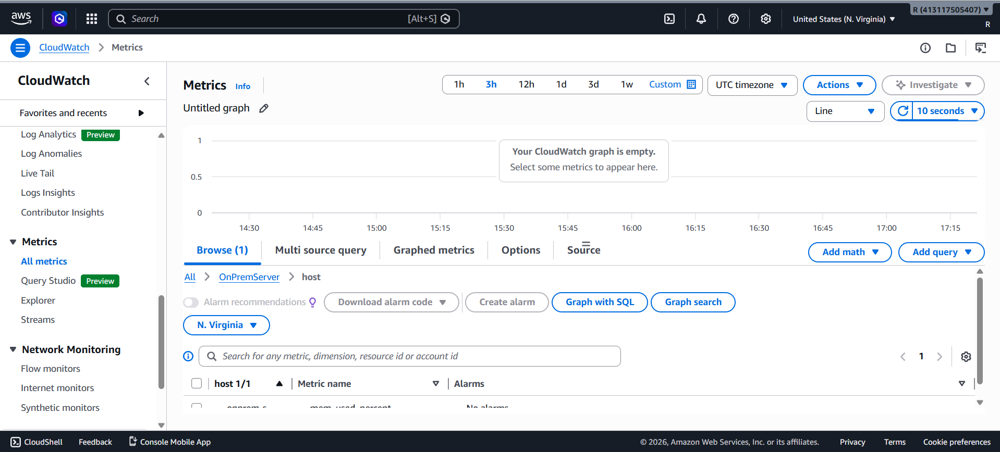
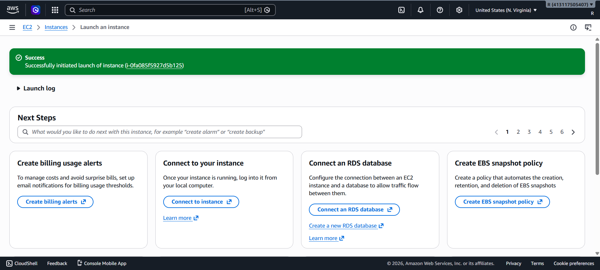
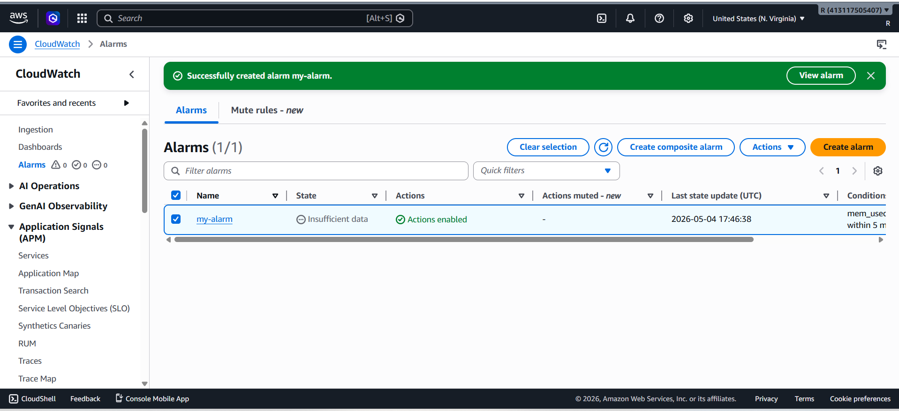
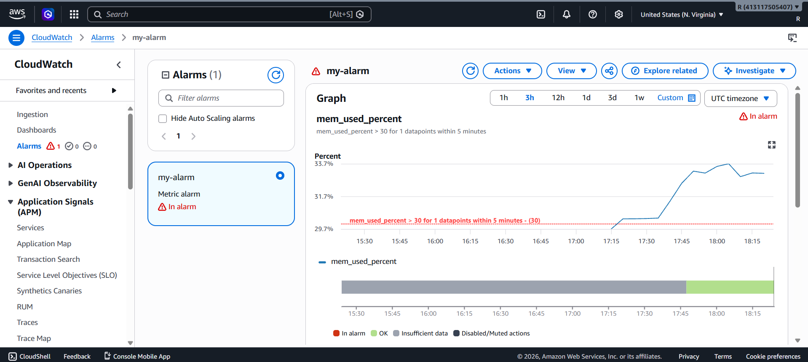
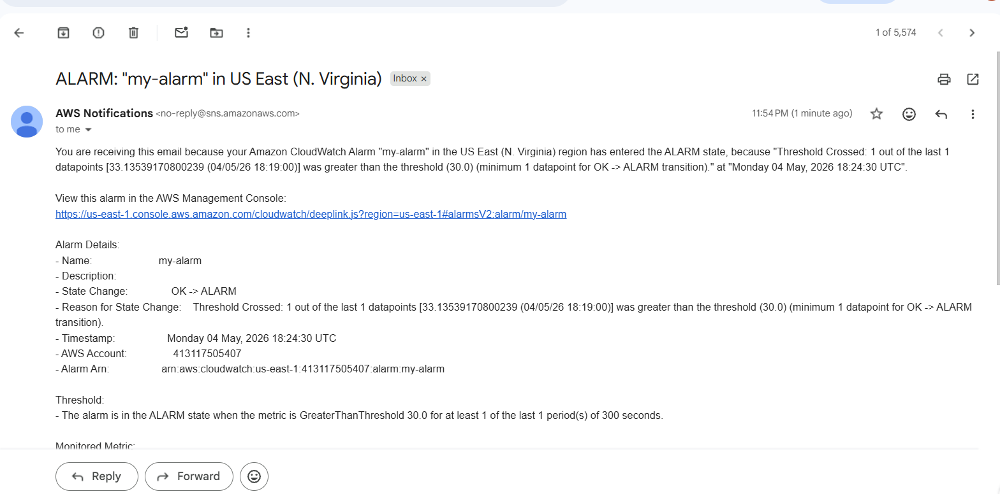

#  Hybrid Infrastructure Monitoring: On-Premise Server Integrated with AWS

##  Project Overview

This project demonstrates a **Hybrid Monitoring System** where:

* On-Premise Server (Local VM) sends metrics to AWS
* AWS EC2 instances are monitored natively
* A centralized dashboard provides unified visibility
* Alerts are triggered based on custom thresholds

---

##  Objective

* Integrate on-premise monitoring with AWS CloudWatch
* Build a centralized monitoring dashboard
* Implement real-time alerting system

---

##  Architecture

* On-Prem VM → CloudWatch Agent → AWS CloudWatch
* EC2 Instance → Default Metrics → CloudWatch
* CloudWatch Dashboard → Unified View
* SNS → Email Alert System

---

##  Technologies Used

* AWS CloudWatch
* AWS EC2
* IAM
* Ubuntu Server (VirtualBox)

---

##  Implementation Steps

### 1️ On-Premise Server Setup

* Installed Ubuntu Server on VirtualBox
* Configured AWS CLI
* Installed CloudWatch Agent

 Screenshot:


---

### 2️ CloudWatch Agent Configuration

* Created config file
* Sent memory metrics to AWS

Screenshot:


---

### 3️ Metrics Verification

* Verified custom namespace in CloudWatch

 Screenshot:


---

### 4️ EC2 Setup

* Launched EC2 instance
* Verified default metrics

 Screenshot:


---

### 5️ Hybrid Dashboard Creation

* Added EC2 CPU metric
* Added On-Prem memory metric

Screenshot:


---

### 6️ Alert Configuration

* Created alarm on memory usage (>70%)
* Configured SNS email notification

 Screenshot:


---

### 7️ Alert Trigger Testing

* Increased memory usage
* Alarm triggered successfully

 Screenshot:


---

### 8️ Email Notification

* Received alert email

 Screenshot:


---

##  Results

* Successfully monitored hybrid infrastructure
* Achieved centralized visibility
* Real-time alerts implemented

---

##  Conclusion

This project demonstrates how organizations can integrate on-premise systems with cloud monitoring tools to achieve a unified monitoring solution.

---

##  Future Enhancements

* Add log monitoring
* Use Grafana for advanced dashboards
* Automate scaling based on alerts

---

##  Configuration File

```json
{
  "agent": {
    "metrics_collection_interval": 60,
    "run_as_user": "root"
  },
  "metrics": {
    "namespace": "OnPremServer",
    "metrics_collected": {
      "mem": {
        "measurement": ["mem_used_percent"]
      }
    }
  }
}
```
